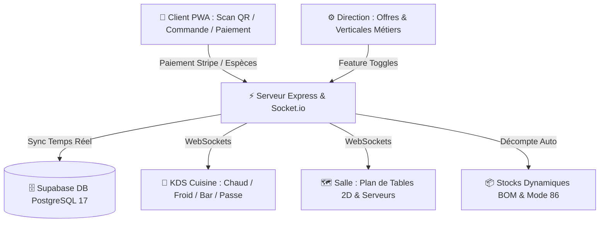

# 📖 Manuel de Formation Complet & Procédures Opérationnelles (SOP)

**Solution Ciao Byebye Restaurant Suite**  
*Version 2.1 — Compatible Supabase PostgreSQL 17 & KDS Multi-Postes*

---

## 📑 Sommaire
1. [Vue d'Ensemble & Architecture du Système](#1-vue-densemble--architecture-du-système)
2. [Matrice des Rôles & Accès](#2-matrice-des-rôles--accès)
3. [Parcours Opérationnel : De l'Accueil à la Clôture](#3-parcours-opérationnel--de-laccueil-à-la-clôture)
4. [Checklist Quotidienne d'Ouverture de Service](#4-checklist-quotidienne-douverture-de-service)
5. [Checklist Quotidienne de Fin de Service](#5-checklist-quotidienne-de-fin-de-service)
6. [Guide de Dépannage Rapide & FAQ](#6-guide-de-dépannage-rapide--faq)
7. [Liens vers les Modules Spécialisés](#7-liens-vers-les-modules-spécialisés)

---

## 1. Vue d'Ensemble & Architecture du Système

Ciao Byebye est une plateforme unifiée connectant en temps réel tous les acteurs du restaurant :

---

## 2. Matrice des Rôles & Accès

| Rôle | Accès Principal | Fonctionnalités Clés |
| :--- | :--- | :--- |
| **Chef Cuisine** | `dashboard.html` (Onglet KDS) | Bons de commande, suites HOLD/FIRE, acquittement allergies, bump, déclaration pertes. |
| **Chef de Rang / Serveur** | `dashboard.html` (Onglet Plan 2D) | Couverts réels, réclame des suites, fusions/splits de tables, encaissement espèces. |
| **Directeur / Manager** | `dashboard.html` (Onglets Stocks & Modules) | Formules Essentiel/Pro/Multi-sites, verticales métiers, fiches recettes BOM, réassort 86. |
| **Client** | `index.html` (PWA sans installation) | Scan QR, choix des plats, modificateurs (SANS/EXTRA/Cuisson), paiement en ligne ou caisse. |

---

## 3. Parcours Opérationnel : De l'Accueil à la Clôture

### Étape 1 : Installation & Saisie des Couverts
- Le serveur installe le client sur la table (ex: Table 03).
- Sur le **Plan 2D**, il clique sur la table et saisit le nombre exact de convives réels.

### Étape 2 : Commande Client & Modificateurs
- Le client scanne le QR code de table, choisit ses plats et précise ses souhaits (ex: *Burger Saignant, SANS Oignons, + EXTRA Cheddar, Allergie Gluten*).
- Dès validation, le décompte d'ingrédients est calculé selon la fiche technique BOM.

### Étape 3 : Traitement Cuisine & Gestion des Suites
- L'entrée et les boissons partent en `🔥 FIRE`.
- Les plats partent en `⏸️ HOLD`.
- Si une allergie est déclarée, la cuisine clique obligatoirement sur `[ ⚠️ Acquitter ]`.
- Au moment opportun, la suite est déclenchée en 1 clic sur `[ 🔥 Réclame ]`.

### Étape 4 : Service à Table & Clôture
- Le chef effectue le bump `[ ✅ Prête à Servir ]`.
- Le serveur apporte les plats au bon numéro de siège (`🪑 S1`, `🪑 S2`).
- En fin de repas, la table est marquée `🧹 À débarrasser` puis `✨ Propre` pour accueillir de nouveaux convives.

---

## 4. Checklist Quotidienne d'Ouverture de Service

- [ ] **1. Connexion au Dashboard** : Ouvrir les tablettes de salle et les écrans tactiles de cuisine.
- [ ] **2. Vérification des Stocks & 86** : Vérifier les ingrédients en alerte basse dans **📦 Stocks & BOM** et réajuster si une livraison est arrivée.
- [ ] **3. Paramétrage du Plan de Salle** : Vérifier les tables de terrasse ouvertes ou les fusions programmées pour les réservations de groupe.
- [ ] **4. Affectation des Rangs** : Assigner les tables aux serveurs en service (*David*, *Sophie*).

---

## 5. Checklist Quotidienne de Fin de Service

- [ ] **1. Clôture des Commandes** : Vérifier qu'aucune commande ne reste en suspens au passe expo.
- [ ] **2. Validation des Encaissements Espèces** : Pointer les paiements espèces validés en caisse.
- [ ] **3. Journal des Pertes** : Vérifier que toutes les pertes du service ont été renseignées.
- [ ] **4. Remise à Zéro des Tables** : Vérifier que toutes les tables du plan 2D sont en statut `✨ Propre` et `🟢 Libre`.

---

## 6. Guide de Dépannage Rapide & FAQ

### Q1 : Un plat apparaît comme épuisé alors que nous avons reçu les ingrédients. Comment le réactiver ?
👉 *Ouvrez l'onglet **📦 Stocks & BOM**, localisez l'ingrédient et cliquez sur le bouton vert `[ ✅ Réassort ]`. Tous les plats associés seront instantanément réactivés sur les QR codes des clients.*

### Q2 : Comment fusionner deux tables si un groupe de 8 personnes s'installe sur les tables 01 et 02 ?
👉 *Sur le **Plan de Tables 2D**, cliquez sur la Table 01 $\to$ cochez la Table 02 dans la section Fusion $\to$ cliquez sur `[ Fusionner ]`.*

### Q3 : Pourquoi le KDS affiche-t-il une bordure rouge clignotante autour d'un bon de commande ?
👉 *Il s'agit de l'**Alerte Temporisation > 20 min**, indiquant que la table attend ses plats depuis plus de 20 minutes. Ce bon doit être priorisé immédiatement.*

---

## 7. Liens vers les Modules Spécialisés

- 🍳 [Guide Détaillé Cuisine & KDS Multi-Postes (Module 1)](file:///Users/zaki/Projet%20KZ%20Menu/docs/formation/MODULE_1_FORMATION_CUISINE_KDS.md)
- 🍽️ [Guide Détaillé Salle, Plan 2D & Service (Module 2)](file:///Users/zaki/Projet%20KZ%20Menu/docs/formation/MODULE_2_FORMATION_SALLE_SERVICE.md)
- ⚙️ [Guide Détaillé Direction, Pricing & Stocks BOM (Module 3)](file:///Users/zaki/Projet%20KZ%20Menu/docs/formation/MODULE_3_FORMATION_DIRECTION_GESTION.md)
- 📱 [Guide Détaillé Client, PWA, Split & Titres-Restaurant (Module 4)](file:///Users/zaki/Projet%20KZ%20Menu/docs/formation/MODULE_4_FORMATION_CLIENT_PWA.md)
