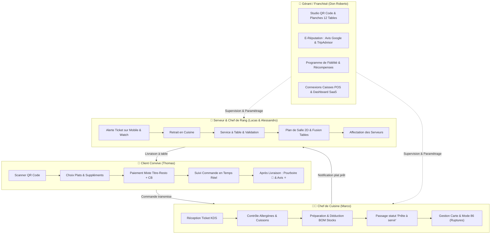
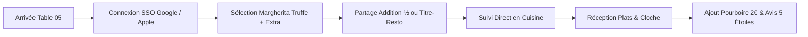
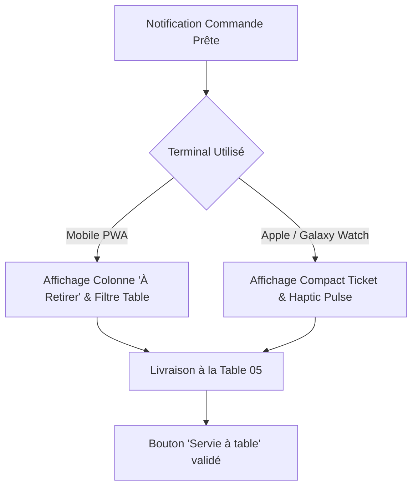
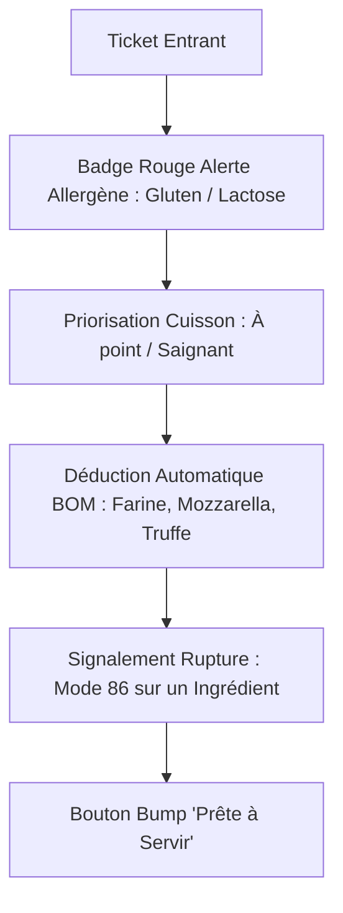
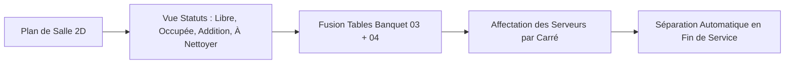
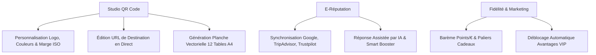

# 🎓 Centre de Formation Vidéo & Parcours Opérationnels Ciao Byebye

Bienvenue dans le centre de formation de **Ciao Byebye** pour le restaurant **Don Roberto Pizzeria Trattoria**.  
Ce guide regroupe les 5 grands parcours utilisateurs sous forme de fiches personas détaillées, diagrammes visuels interactifs et vidéos de démonstration.

---

## 🗺️ Cartographie Globale des Personas & Rôles

---

## 1. 👤 Parcours Client : "Thomas le Gourmet"

### 📋 Scénarios Clés Démontrés :
1. **Paiement Hybride Titre-Restaurant + Complément Carte Bancaire** :
   - Sélection de l'onglet **Titre-Resto** dans le panier.
   - Saisie du montant déduit (ex: 19.00 € pris en charge par la carte Swile/Edenred).
   - Complément automatique réglé en Carte Bancaire ou Apple Pay en 1 clic.
2. **Partage de l'addition entre convives (Split Bill)** :
   - Choix du fractionnement instantané : ½ (2 personnes), ⅓ (3 personnes), ¼ (4 personnes) ou sur-mesure (jusqu'à 20 convives).
   - Calcul immédiat de la quote-part par convive avec QR code de paiement individuel.
3. **Suivi de commande temps réel (Live Tracker)** :
   - Progression dynamique en 3 jalons : *En cuisine 🔥 -> Prête en salle 🔔 -> Servie à table 🎉*.
4. **Expérience Post-Livraison (Pourboire & Avis)** :
   - Les boutons de pourboire et d'avis n'apparaissent qu'une fois la commande livrée à table.
   - Sélection rapide du pourboire (1€, 2€, 3€, 5€) avec remerciement direct pour la brigade.
   - Dépôt d'un avis noté avec proposition de synchronisation sur Google Avis.

🎥 **Vidéo disponible** : `formation/parcours_client/demo_client_kds_complet.webp`

---

## 2. 📱 Parcours Serveur : "Lucas en Salle"

### 📋 Scénarios Clés Démontrés :
1. **Récupération de la commande sur Mobile** :
   - Accès filtré aux tables assignées à Lucas (ex: Tables 01 à 06).
   - Notification sonore et visuelle dès qu'un plat passe au statut "Prête".
   - Bouton d'action à un pouce : *"Servie à table"*.
2. **Interface Connectée Montre (Smartwatch)** :
   - Format ultra-compact adapté aux cadrans 40-44mm.
   - Affichage immédiat : Numéro de table, plats principaux et heure de commande.
   - Validation haptique sans avoir à sortir le smartphone de sa poche.

---

## 3. 👨‍🍳 Parcours Chef de Cuisine : "Marco au Piano"

### 📋 Scénarios Clés Démontrés :
1. **Traitement d'une commande avec Allergène & Cuisson** :
   - Mise en évidence des étiquettes sensibles (ex: *Allergie Arachide*, *Sans Gluten*, *Cuisson Bien Cuit*).
   - Sécurisation du service en cuisine pour éviter toute contamination croisée.
2. **Gestion du BOM (Nomenclature / Fiche Technique Recette)** :
   - Chaque plat consomme les stocks d'ingrédients au gramme près (ex: 220g pâte, 90g fior di latte, 15g crème de truffe).
3. **Activation du Mode 86 (Rupture Immédiate)** :
   - Désactivation d'un plat ou d'un ingrédient en 1 clic.
   - Synchronisation instantanée sur la carte de tous les clients connectés.

---

## 4. 👔 Parcours Chef de Rang / Maître d'Hôtel : "Alessandro"

### 📋 Scénarios Clés Démontrés :
1. **Gestion du Plan de Salle 2D** :
   - Visualisation de la salle intérieure et de la terrasse.
   - Codification couleur : *Vert (Libre)*, *Bleu (En cours)*, *Orange (Addition demandée)*, *Gris (À nettoyer)*.
2. **Fusion & Séparation de Tables** :
   - Assemblage instantané pour grandes tablées avec fusion des commandes et du panier partagé.
   - Dissociation manuelle ou automatique à la clôture de caisse.
3. **Affectation des Serveurs** :
   - Répartition par zones pour équilibrer la charge de travail de l'équipe.

---

## 5. 👑 Parcours Gérant / Franchisé : "Don Roberto"

### 📋 Scénarios Clés Démontrés :
1. **Studio QR Code Haute Définition** :
   - Norme ISO 18004 respectée avec zone de silence de 4 modules.
   - URL personnalisable en temps réel.
   - Export d'une planche d'impression 12 tables en SVG vectoriel 1200 DPI sans dépendance externe.
2. **Pilotage de l'e-Réputation** :
   - Centralisation des avis multi-plateformes avec calcul de la moyenne globale.
   - Redirection automatique des avis 5 étoiles vers Google My Business.
3. **Programme de Fidélité & Gamification** :
   - Réglage du taux de points (ex: 1€ dépensé = 1 point), offres cadeaux (ex: Dessert offert à 100 pts) et bonus de bienvenue.

---

## 📹 Récapitulatif des Fichiers Vidéo (.MP4, .AVI & .WEBP)

Tous les scénarios disposent désormais d'une version vidéo **`.mp4` (H.264)** pour lecture directe dans le navigateur avec contrôles interactifs (pause, retour en arrière, ralenti 0.5x) et d'une version **`.avi` (XviD / MPEG-4)** pour téléchargement universel :

| Persona | Vidéo MP4 (Navigateur) | Vidéo AVI (Téléchargement) | Format WebP | Durée & Résolution |
| :--- | :--- | :--- | :--- | :--- |
| **👤 Client (Complet)** | [`parcours_client/demo_client_kds_complet.mp4`](file:///Users/zaki/Projet%20KZ%20Menu/formation/parcours_client/demo_client_kds_complet.mp4) | [`parcours_client/demo_client_kds_complet.avi`](file:///Users/zaki/Projet%20KZ%20Menu/formation/parcours_client/demo_client_kds_complet.avi) | [`demo_client_kds_complet.webp`](file:///Users/zaki/Projet%20KZ%20Menu/formation/parcours_client/demo_client_kds_complet.webp) | 1m 32s • 1920x1000 • 3.4 MB |
| **👤 Client (Split / Titre-Resto)** | [`parcours_client/demo_client_titre_resto_split_bill.mp4`](file:///Users/zaki/Projet%20KZ%20Menu/formation/parcours_client/demo_client_titre_resto_split_bill.mp4) | [`parcours_client/demo_client_titre_resto_split_bill.avi`](file:///Users/zaki/Projet%20KZ%20Menu/formation/parcours_client/demo_client_titre_resto_split_bill.avi) | [`demo_client_titre_resto_split_bill.webp`](file:///Users/zaki/Projet%20KZ%20Menu/formation/parcours_client/demo_client_titre_resto_split_bill.webp) | 24s • 1920x1000 • 284 KB |
| **📱 Serveur (Mobile & Watch)** | [`parcours_serveur/demo_serveur_mobile_watch.mp4`](file:///Users/zaki/Projet%20KZ%20Menu/formation/parcours_serveur/demo_serveur_mobile_watch.mp4) | [`parcours_serveur/demo_serveur_mobile_watch.avi`](file:///Users/zaki/Projet%20KZ%20Menu/formation/parcours_serveur/demo_serveur_mobile_watch.avi) | [`demo_serveur_mobile_watch.webp`](file:///Users/zaki/Projet%20KZ%20Menu/formation/parcours_serveur/demo_serveur_mobile_watch.webp) | 27.5s • 1920x1000 • 1.1 MB |
| **👨‍🍳 Chef de Cuisine (KDS & BOM)** | [`parcours_cuisine/demo_cuisine_allergene_bom_menu.mp4`](file:///Users/zaki/Projet%20KZ%20Menu/formation/parcours_cuisine/demo_cuisine_allergene_bom_menu.mp4) | [`parcours_cuisine/demo_cuisine_allergene_bom_menu.avi`](file:///Users/zaki/Projet%20KZ%20Menu/formation/parcours_cuisine/demo_cuisine_allergene_bom_menu.avi) | [`demo_cuisine_allergene_bom_menu.webp`](file:///Users/zaki/Projet%20KZ%20Menu/formation/parcours_cuisine/demo_cuisine_allergene_bom_menu.webp) | 24s • 1920x1000 • 336 KB |
| **👔 Chef de Rang (Salle & Fusion)** | [`parcours_chef_de_rang/demo_chef_de_rang_salle_fusion_serveur.mp4`](file:///Users/zaki/Projet%20KZ%20Menu/formation/parcours_chef_de_rang/demo_chef_de_rang_salle_fusion_serveur.mp4) | [`parcours_chef_de_rang/demo_chef_de_rang_salle_fusion_serveur.avi`](file:///Users/zaki/Projet%20KZ%20Menu/formation/parcours_chef_de_rang/demo_chef_de_rang_salle_fusion_serveur.avi) | [`demo_chef_de_rang_salle_fusion_serveur.webp`](file:///Users/zaki/Projet%20KZ%20Menu/formation/parcours_chef_de_rang/demo_chef_de_rang_salle_fusion_serveur.webp) | 24s • 1920x1000 • 251 KB |
| **👑 Gérant (QR Studio & Avis)** | [`parcours_gerant/demo_gerant_qrcode_avis_fidelite.mp4`](file:///Users/zaki/Projet%20KZ%20Menu/formation/parcours_gerant/demo_gerant_qrcode_avis_fidelite.mp4) | [`parcours_gerant/demo_gerant_qrcode_avis_fidelite.avi`](file:///Users/zaki/Projet%20KZ%20Menu/formation/parcours_gerant/demo_gerant_qrcode_avis_fidelite.avi) | [`demo_gerant_qrcode_avis_fidelite.webp`](file:///Users/zaki/Projet%20KZ%20Menu/formation/parcours_gerant/demo_gerant_qrcode_avis_fidelite.webp) | 46.2s • 1920x1000 • 1.8 MB |

